# DisasterAlert 🛰️

> Plataforma de monitoramento de desastres naturais via dados satelitais em tempo real.

---

## 📋 Descrição

O **DisasterAlert** é uma solução web desenvolvida para a **Global Solution 2026/1 — FIAP**, com o tema *O Espaço é a Nova Fronteira*. A plataforma utiliza dados de satélites reais (GOES-16, CBERS-4A e AQUA/MODIS) para detectar, analisar e alertar sobre desastres naturais como enchentes, queimadas, deslizamentos e tempestades em tempo real, conectando a tecnologia espacial à proteção de vidas na Terra.

---

## 🚀 Tecnologias Utilizadas

- **HTML5** — estrutura semântica
- **CSS3** — estilização modular, responsividade com media queries, animações
- **JavaScript** (ES6+) — interatividade, Web Audio API, manipulação do DOM
- **Git / GitHub** — versionamento e colaboração

---

## 📁 Estrutura de Pastas

```
disaster-alert/
├── index.html
├── assets/
│   ├── audio/
│       ├── audio_alert.mpeg
│   ├── img/
│   │   ├── aqua.jpg
│   │   ├── avatar_fundo.png
│   │   ├── cbers4a.jpg
│   │   ├── contato.png
│   │   ├── dashboard.png
│   │   ├── diego.jpg
│   │   ├── disasteralert-icon.svg
│   │   ├── disasteralert-logo.jpg
│   │   ├── faq.png
│   │   ├── fundo_site.png
│   │   ├── goes16.png
│   │   ├── igor.jpg
│   │   ├── index.png
│   │   ├── integrantes.pgn
│   │   ├── mapa_brasil.png
│   │   ├── miguel.jpg
│   │   ├── mobile.png
│   │   ├── quiz.png
│   │   ├── rafael.jpg
│   │   ├── simulacao.png
│   │   ├── sobre.png
│   │   ├── solucao_1.png
│   │   ├── solucao_2.png
│   │   └── timeline.png
│   └── video/
│       ├── inicio_intro.mp4
│       └── satelite.mp4
├── css/
│   ├── componentes/
│   │   ├── animacoes.css
│   │   ├── badges.css
│   │   ├── cards.css
│   │   ├── chat.css
│   │   ├── faq.css
│   │   ├── form.css
│   │   ├── intro.css
│   │   ├── map.css
│   │   ├── modal-simulacao.css
│   │   ├── pipeline.css
│   │   ├── quiz.css
│   │   ├── satelites.css
│   │   ├── simulacao.css
│   │   ├── solucao.css
│   │   ├── table.css
│   │   ├── team.css
│   │   └── timeline.css
│   ├── layout.css
│   ├── main.css
│   ├── modal.css
│   ├── reset.css
│   ├── responsive.css
│   └── variaveis.css
│
├── js/
│   ├── chat.js
│   ├── dashboard.js
│   ├── faq.js
│   ├── formulario.js
│   ├── main.js
│   ├── modal.js
│   ├── quiz.js
│   ├── simulacao.js
│   ├── solucao.js
│   └── timeline.js
├── pages/
│   ├── contato.html
│   ├── dashboard.html
│   ├── faq.html
│   ├── integrantes.html
│   ├── quiz.html
│   ├── simulacao.html
│   ├── sobre.html
│   ├── solucao.html
│   ├── timeline.html
│   └── index.html
│
└── README.md
```

---

## 🌐 Páginas

| Página | Descrição |
|---|---|
| `index.html` | Dashboard principal com mapa, feed de alertas e scanner de satélite |
| `pages/sobre.html` | Descrição do projeto, pipeline de funcionamento e tipos de desastre monitorados |
| `pages/solucao.html` | Focada em apresentar a tecnologia do projeto, o pipeline de dados (como as informações de satélite chegam até o usuário) e o impacto socioambiental. |
| `pages/historico.html` | Focada na linha do tempo dos desastres já registrados, relatórios gerados e na evolução das métricas monitoradas pela plataforma. |
| `pages/dashboard.html` | Central de alertas com tabela filtrável, cards de satélites e modal de detalhes |
| `pages/simulacao.html` | Simulação interativa de cenários de desastre com timer e análise de risco |
| `pages/quiz.html` | Quiz educativo sobre desastres naturais e satélites |
| `pages/faq.html` | Perguntas frequentes sobre a plataforma |
| `pages/contato.html` | Formulário de contato com validação |
| `pages/integrantes.html` | Equipe do projeto com links para GitHub e LinkedIn |

---

## ✨ Funcionalidades

- **Dashboard em tempo real** com feed de alertas atualizado automaticamente
- **Mapa do Brasil** interativo com pontos de ocorrência por severidade
- **Scanner de satélite** com vídeo animado de varredura
- **Modo Caos** — simulação de emergência com sirene via Web Audio API
- **Tabela de alertas** com filtros por severidade e status
- **Simulação de desastres** com cenários, timer e análise de risco
- **Quiz** educativo sobre satélites e desastres naturais
- **Chat assistente** com avatar animado e respostas sobre o projeto
- **Layout totalmente responsivo** — mobile (480px), tablet (768px) e desktop (1300px+)

---

## 🛰️ Satélites Utilizados

| Satélite | Origem | Uso no projeto |
|---|---|---|
| GOES-16 | NASA/NOAA | Monitoramento de tempestades e enchentes |
| CBERS-4A | INPE/China | Detecção de queimadas e deslizamentos |
| AQUA/MODIS | NASA | Análise de focos de calor e queimadas |

---

## 🎨 Paletas de cores

| Cor                   | Hex       | Uso                                   |
| --------------------- | --------- | ------------------------------------- |
| 🟦 Fundo Principal    | `#111827` | Background geral da aplicação         |
| 🟪 Cards              | `#1a2332` | Containers e cartões de conteúdo      |
| 🌑 Sidebar            | `#110a2a` | Menu lateral                          |
| 🔵 Topbar             | `#1e2d3d` | Barra superior                        |
| ⚫ Inputs              | `#0d1521` | Campos de entrada                     |
| 🟣 Destaque Principal | `#a78bfa` | Botões, links e elementos interativos |
| 💜 Roxo Secundário    | `#8b5cf6` | Hover e componentes secundários       |
| 🟢 Sucesso            | `#22c55e` | Indicadores positivos                 |
| 🔴 Erro               | `#ff4444` | Alertas e mensagens de erro           |
| 🟠 Aviso              | `#f59e0b` | Notificações e alertas                |
| 🟡 Atenção            | `#fbbf24` | Estados intermediários                |
| 🔵 Informação         | `#3b82f6` | Informações e ações secundárias       |
| ⚪ Texto Principal     | `#e5e7eb` | Títulos e conteúdo principal          |
| ⚫ Texto Secundário    | `#9ca3af` | Textos complementares                 |
| ⚫ Texto Suave         | `#6b7280` | Informações menos relevantes          |


## 🌍 Conexão Estratégica com os ODS da ONU 🌟

O ecossistema da aplicação foi desenhado com o propósito de mitigar impactos ambientais e potencializar a produção tecnológica, atendendo diretamente aos critérios globais da **Agenda 2030**:

### 🛠️ ODS 9 — Indústria, Inovação e Infraestrutura
> **No Projeto:** Integração de processamento de dados satelitais e telemetria avançada no campo. A infraestrutura conecta inteligência artificial ao manejo agronômico de forma acessível, modernizando os processos de ponta a ponta.

### 🏢 ODS 11 — Cidades e Comunidades Sustentáveis
> **No Projeto:** Otimização da cadeia de suprimentos e inteligência territorial, garantindo que o impacto da produção rural colabore diretamente para o abastecimento consciente, seguro e sustentável de comunidades urbanas integradas.

### 🌱 ODS 13 — Ação Contra a Mudança Global do Clima
> **No Projeto:** Monitoramento ativo contra o desmatamento e otimização do uso de recursos hídricos e insumos através de imagens de satélite. A plataforma fornece dados preditivos para que produtores combatam o desperdício e reduzam a pegada de carbono operacional.
## 📸 Preview

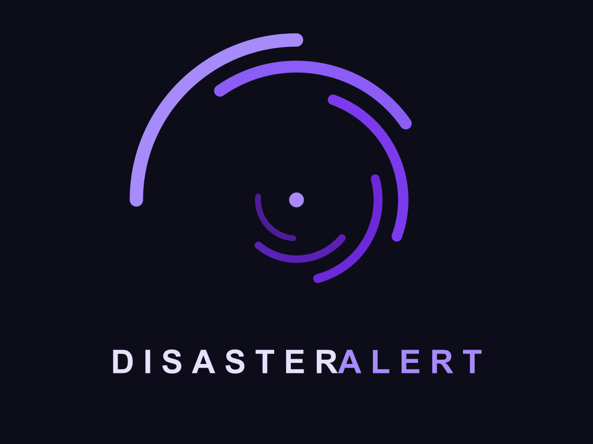
## 📸 Telas do Sistema

### Página Inicial
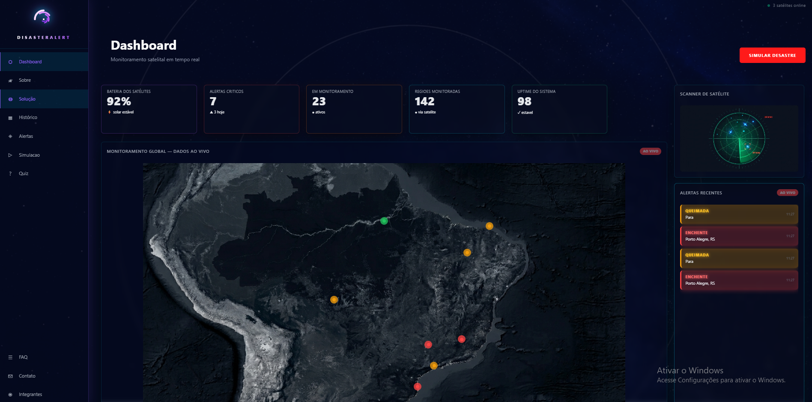

### Dashboard
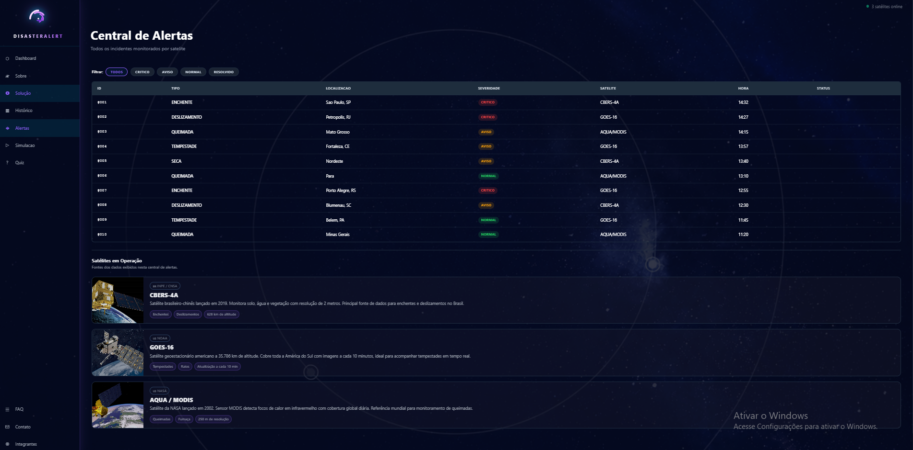

### Sobre
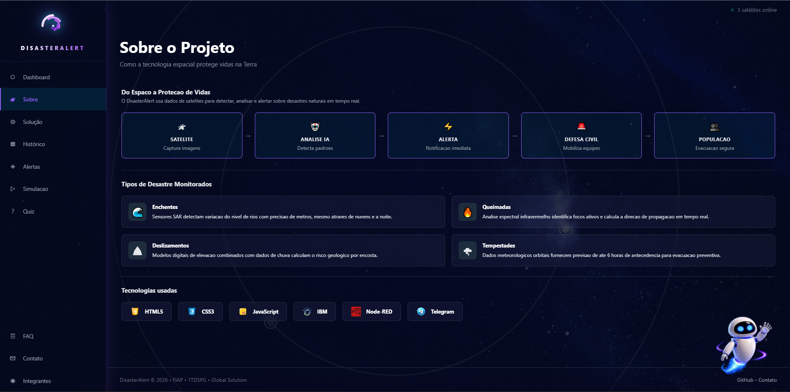

### Simulação
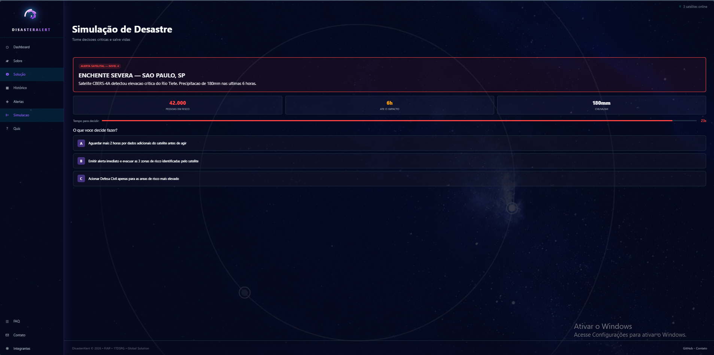

### Quiz
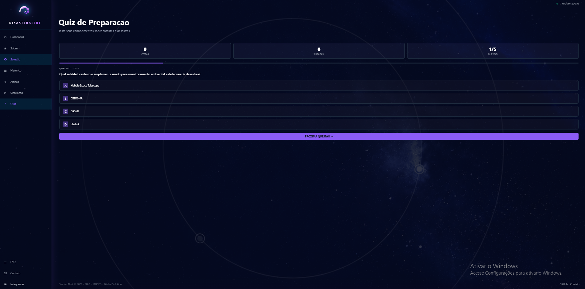

### Timeline
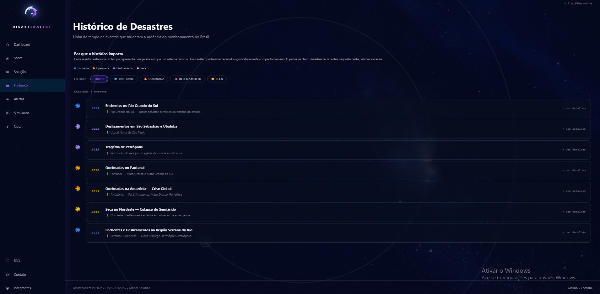

### Solução
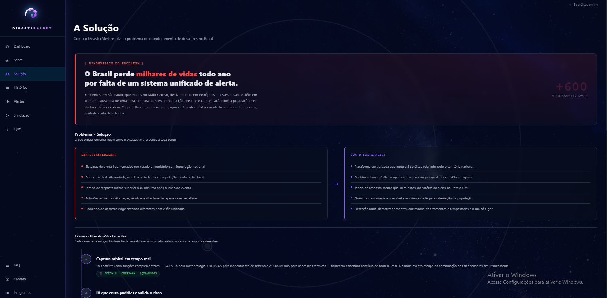
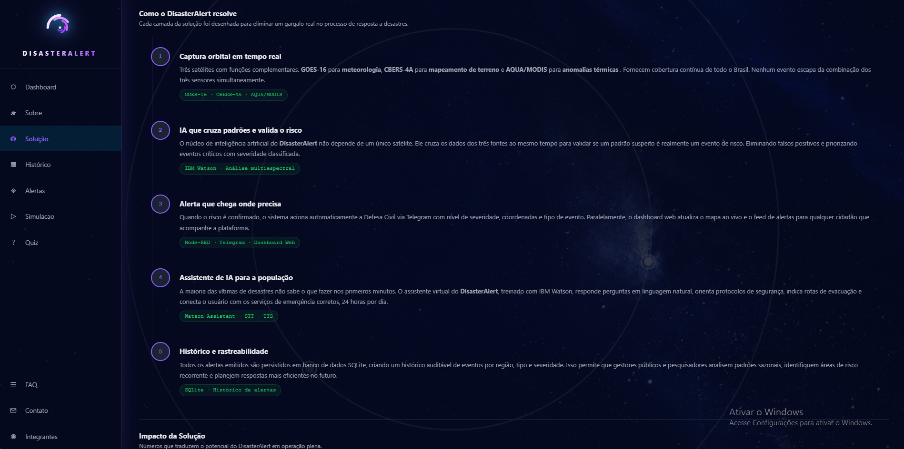

### FAQ
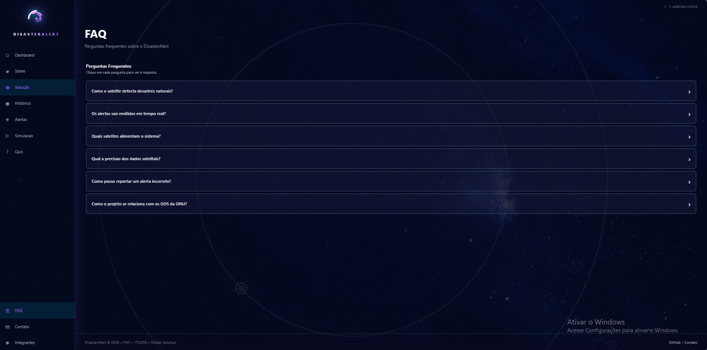

### Contato
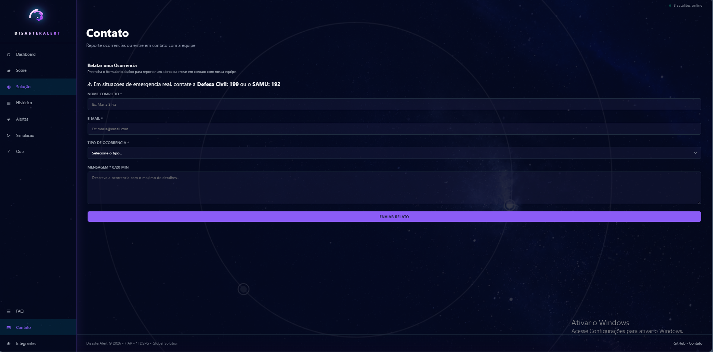

### Integrantes
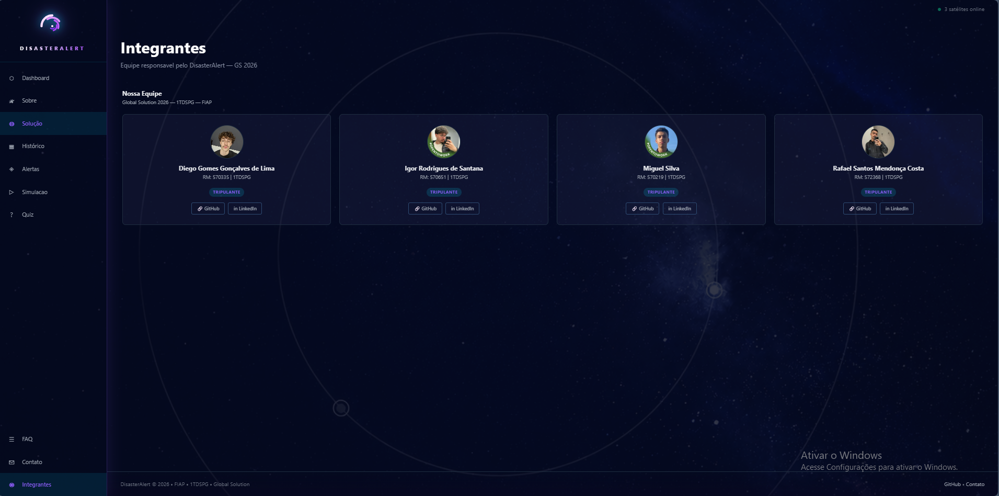

### Mobile
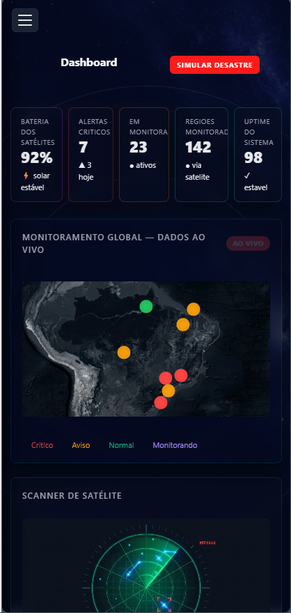

---

## 🔗 Repositório

[https://github.com/RafaelSantos56/Gs_Semestre1](https://github.com/RafaelSantos56/Gs_Semestre1)

---

## 👥 Autores e Créditos

| Foto | Nome | RM | Turma | GitHub | LinkedIn |
|---|---|---|---|---|---|
|  | Diego Gomes Gonçalves de Lima | 570335 | 1TDSPG | [dgxls](https://github.com/dgxls) | [LinkedIn](https://linkedin.com/in/diego-gomes-65339b408) |
|  | Igor Rodrigues de Santana | 570651 | 1TDSPG | [igorodriguesd](https://github.com/igorodriguesd) | [LinkedIn](https://linkedin.com/in/igor-rodrigues-135aa72b2) |
|  | Miguel Silva | 570219 | 1TDSPG | [miguelsilva71](https://github.com/miguelsilva71) | [LinkedIn](https://linkedin.com/in/miguel-silva-0a20073a9) |
|  | Rafael Santos Mendonça Costa | 572368 | 1TDSPG | [RafaelSantos56](https://github.com/RafaelSantos56) | [LinkedIn](https://linkedin.com/in/rafael-santos-b09bba237) |

---

## 📞 Contato

Dúvidas ou sugestões sobre o projeto podem ser enviadas pelo formulário na página [Contato](disaster-alert/pages/contato.html) ou diretamente pelo GitHub de qualquer integrante acima.

---

> Global Solution 2026/1 — FIAP — 1TDSPG